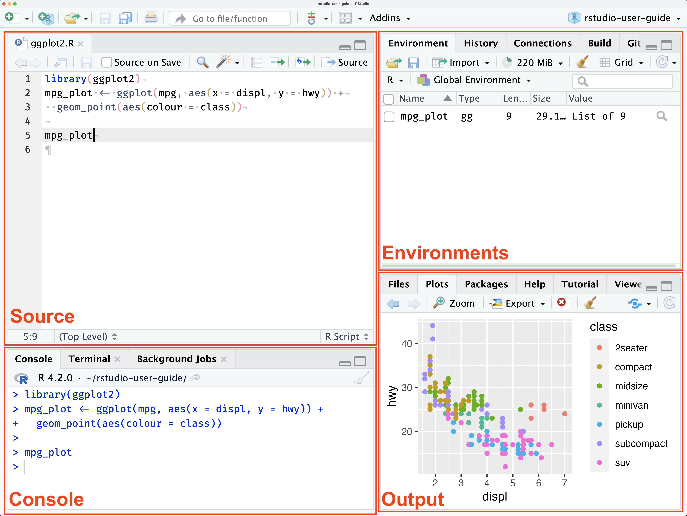

# Introduction

Now that you have successfully downloaded R and R Studio, and have a few classes under your belt, you are ready to begin practicing some of the skills and tools we are learning. 

# R and RStudio

Let’s first discuss R and the RStudio window.

The pane in the upper left contains your **source** or workspace. This is where you will be typing your lab and  R code. It it also where your R script lives. 
 
Any plots that you generate will show up in the pane in the lower right corner. This is called the **output** pane.

The pane on the upper left corner is where the action happens. It is called the console. Every time you launch RStudio, it will have the same text at the top of the console telling you the version of R that you’re running. Below that information is the prompt. As its name suggests, this prompt is really a request, a request for a command. Initially, interacting with R is all about typing commands and interpreting the output. These commands and their syntax have evolved over decades (literally) and now provide what many users feel is a fairly natural way to access data and organize, describe, and invoke statistical computations.

The **environment** pane is located at the bottom left and this is where your current saved R objects live.



The placement of the panes might look different for you. This is okay. You can change the placement of the source, console, output and environment panes. You can modify the placement of these by going to **Tools** > **Global Options** > **Pane Layout.**


You can use R as a calculator. To get you started, enter the following command at the R prompt (i.e. right after `>` on the console). You can either type it in manually or copy and paste it from this document.


```{r}
2+3
```

And you can save this result to an object that you can access later

```{r}
x = 2+3
```

Try typing `x` in the console to verify that. 

You can also see this new object in your environment on the upper right pane.  Next time you log on to RStudio the object will still be here.

Throughout the semester you will learn about how to use R to do data analysis,  and in the meantime you will be exposed to some programming. In addition, you  will learn best practices for saving your code and making sure that your  analysis is reproducible.


Now let's discuss R Markdown.

# R Markdown

This is an R Markdown document. Markdown is a simple formatting syntax for writing HTML, PDF, and Word documents. For more details on using R Markdown see <http://rmarkdown.rstudio.com>. You can also use this very useful cheat sheet <https://www.rstudio.com/wp-content/uploads/2015/02/rmarkdown-cheatsheet.pdf>

When you click the **Knit** button, a document will be generated that includes both content as well as the output of any embedded R code chunks within the document. You can embed an R code chunk like this:

```{r cars}
summary(cars)

```

Your R code should start with 
```{r, eval=FALSE} 
``` {r} and should end with ```   
```

You can also embed plots, or images for example:

```{r pressure, echo=FALSE}
plot(pressure)
```

Note that the `echo = FALSE` parameter was added to the code chunk to prevent printing of the R code that generated the plot. However, if you want to include that into your file, you can set it to be `echo = TRUE` and it will print the R code when you **Knit** the document.

For your labs, make sure that you are printing **only** relevant R code and output in your R Markdown file. Another useful parameter to set as either TRUE or FALSE will be `eval =`. Set `eval=TRUE` if you want to evaluate the code and include its results in the document. Set `eval=FALSE` if you do not want the results to show in the document.

## Creating a Reproducible Lab Report

We will be using R Markdown, to type up the lab reports. This allows you to complete your labs entirely in RStudio as well as ensuring reproducibility of your R analysis and results. To help get you started, I am providing a template for you. Use the following code to download this template:

```{r load-template}
#download.file("https://github.com/angelaxocampo/SSM/raw/main/Lab_1/lab1.Rmd", destfile = "lab1.Rmd")
```

# Set Working Directory

Remember that for Lab 0 you were supposed to set up a folder structure. This time, you will set up a new folder structure for Lab 1 where you will store your Lab1.Rmd file. You will continue to do this for all of your future labs. 

# Loading data

We are going to begin by learning how to load data, deal with packages and other R functions. We will be using the 2006 Latino National Survey (LNS) as our main data to practice all the tools and techniques we are learning. For more information on the LNS: <https://www.icpsr.umich.edu/web/ICPSR/studies/20862#>

To load the data, we will begin by installing all the necessary R packages. R packages are a collection of R functions, data and code that has been compiled to add functionality and ease of use.

There are a set of base packages that are considered part of the R source code and were automatically included when you downloaded R. Other packages, however, have been created by other data scientists. So, you have to download these packages yourself. Once you have downloaded them once, you do not have to download them again. But you will have to load them everytime you open RStudio and begin coding and analyzing data.

Some of the packages we will be using the most in this class come from tidyverse. Tidyverse includes the following packages: ggplot2, dplyr, tidyr, readr, purr, tibble, stringr, and forecats. We will also be using the haven package. To install these packages for the first time run this code.

```{r eval=FALSE}
install.packages("tidyverse", "haven")
```

After installing them you can load them by running the code `library()` and listing the packages you want to load. 

```{r}
library(tidyverse)
library(haven)
```

We now have all the tools to load the LNS dataset. To load the data, you can run the following code, which uses the `read_dta` command to read the file. This file in .dta (Stata) format, but we can read it into R. In fact, we can read all sorts of data files into R including: SPSS, Stata, Rdata, CSV and so much more :)

```{r load, echo=TRUE}
LNS <-read_dta(url("https://github.com/angelaxocampo/SSM/raw/main/Lab_1/Data/LNS.dta"))
```

This data is in .dta (Stata) format. But we have used the haven package to read the data into R.

The LNS data that you have loaded is now in your environment. You can now take a look at the data and begin to explore the variables in the data.

To look at the many variables that exist in the data set, you can type:

```{r names, echo=TRUE, eval=FALSE}
names(LNS)

```

Because there are so many variables, we will have to work with the codebook to identify key and relevant variables for our research. This is of course after have we have identified  our research question, hypotheses and the relevant variables we might want to examine. But because we are practicing our skills here, we will just start by summarizing our data and visualizing.

A codebook provides information about the structure, contents and layout of a data file. You should always review a codebook before downloading data or starting to work on data analysis. You can download the codebook for the LNS from here:

```{r}
#download.file("https://github.com/angelaxocampo/SSM/raw/main/Lab_1/Codebook/Codebook.pdf", destfile = "LNS_Codebook.pdf")
```


# Organizing and Summarizing Data

Let's see we are first interested in understanding where Latinos who were surveyed live. Looking at the codebook, we learn that the variable called `RSTATE` represents the state of residency of respondents. To get a sense of the distribution we can run the following code.

```{r}
LNS %>% 
  count(RSTATE) 
```
The code is telling R to look within the LNS data frame and count the observations by the variable called `RSTATE`. We use the ` %>% ` symbol, also called a pipe. It runs from the magrittr package. It basically tells R to take the output from one function and feed it into the argument from another.  In this case, it tells R to take the LNS data and count the unique values of the variable. We will be using ` %>% ` so it is important that you start familiarizing yourself with it.

Okay, now we have created a frequency distribution for state of residency among our respondents. Looking at the frequency table this way, allows us to get a better sense of the data an summarize the information from those 8,634 people that answered the survey. We learn quite a lot. We see that only 62 respondents live in D.C. but 811 respondents live in TX. 

```{r}
LNS %>% 
  count(RSTATE) %>% 
  mutate(pct = prop.table(n) * 100 )
```


# Visualizing Data


```{r}
ggplot(LNS, aes(RSTATE)) +
  geom_bar()
```


```{r}
ggplot(LNS, aes(x=AGE)) +
  geom_histogram(binwidth = 2)
```


# Sources

- Garcia-Rios. Puzzle Solving with Data. <https://garciarios.github.io/govt_3990/index.html>
- R Studio User guide: <https://docs.posit.co/ide/user/ide/guide/ui/ui-panes.html>
- R for Data Science:<https://r4ds.hadley.nz/intro>